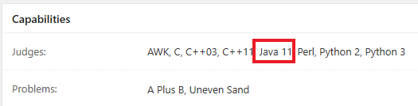

# 別のプログラミング言語の追加方法
デフォルト言語以外でも、DMOJがサポートされている言語を追加することができます。今回は、Java 11を追加してみようと思います。

## サポートされている言語
サポートされている言語は[このページ](https://github.com/DMOJ/judge/tree/master/dmoj/executors)から確認できます。また、公式DMOJの提出ページからも確認できます。

## コンパイラのインストール
今回は、JDK11をインストールします。
```
sudo apt install openjdk-11-jdk
```
正常にインストールされたか確認してみましょう。
```
java -version
javac -version
```
## 新しい言語の追加

### languageページに追加
http://localhost/admin/judge/language にアクセスして、左上の`Add`ボタンを押します。
登録画面の各項目は次のように設定します。
- Short identifier
    - [このページ](https://github.com/DMOJ/judge/tree/master/dmoj/executors)の名前を記入します。例えば、`Java 11`の場合、`JAVA11`となります。（基本的にすべて大文字）
- Long name
    - これは基本的には自由。ここでは`Java 11`としました。
- Short name
    - 必須ではありません。ここでは省略します。
- Common name
    - バージョン情報などを取り除いた言語名。ここでは`Java`としました。
- Ace mode name
    - Ace Editorのハイライト表示に使用する言語を記入します。Common nameの先頭を小文字にしたものでよいと思います。ここでは、`java`としました。
- Pygments name
    - Siteのソースコード画面に表示する名前。ユーザーに分かりやすい名前にする必要があります。ここでは、`Java 11`としました。
- Runtime info override
    - どのようなコンパイラやインタプリタを使用しているのか簡単に記入します。ここでは、`OpenJDK-11.0.4`としました。

すべて登録できたら、下にある`Save`ボタンを押して、保存します。

### `judge.yml`への追加方法
`runtime:`の最後に追記します。Javaの場合はJDKとJREの両方を追加する必要があるみたいです。
```yml
runtime:
  java11: /usr/bin/java
  javac11: /usr/bin/javac
```

### Supervisordの再起動
次のコマンドでSupervisordを再起動します。
```
sudo supervisorctl reload
```

### 追加されたか確認
http://localhost/admin/judge/judge/ から`ExampleJudge`に移動して、`Capabilities`の`Judges`に`Java 11`が追加されていることを確認します。  
