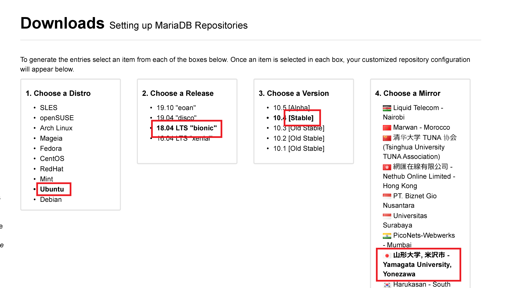

# Siteのセットアップ
## dmoj用ユーザーの追加
次の手順でDMOJ動作用のユーザーを追加し、sudo権限を与えます。
```
sudo useradd dmoj
sudo gpasswd -a dmoj sudo
```
## Mariadbのリポジトリ追加
https://downloads.mariadb.org/mariadb/repositories/ にアクセスします。  
それぞれの項目は、次のように選択します。
1. Choose a Distro: Ubuntu
1. Choose a Release: 自分の使用しているバージョン（画像では20.04）
1. Choose a Version: 最新（一番上）のバージョン（画像では10.5）
1. Choose a Mirror: 日本のサーバ（画像では山形大学）  
※日本のサーバでなくてもよい



すべて選択し終わったら、画面下の`Here are the commands to run to install MariaDB 10.x from the MariaDB repository on your Ubuntu system:`に書いてあるコマンドで、リポジトリを追加し、さらに次のコマンドで反映させます。
```sh
sudo apt update
```
## 必要なパッケージのダウンロード
必要なソフトウェアをすべてダウンロードします。
```
sudo apt install -y git gcc g++ make python3-dev libxml2-dev libxslt1-dev zlib1g-dev gettext curl python3-pip mariadb-server libmysqlclient-dev supervisor nginx redis-server
```
## Nodejsのダウンロードとインストール
ここでは、バージョン12を使用します。また、`npm`で追加で必要なパッケージもインストールしてしまいます。
```
curl -sL https://deb.nodesource.com/setup_12.x | sudo -E bash -
sudo apt install -y nodejs
sudo npm install -g sass postcss postcss-cli autoprefixer
```
## MySQLの設定
必ずスーパーユーザーとして実行してください。
```
sudo mysql_secure_installation
``` 
起動すると、
> Enter current password for root (enter for none): 

と聞かれますが、まだ設定していないため、何も入力せず、Enterキーを押します。

次に、
> Switch to unix_socket authentication [Y/n]

というような感じでUnix_Socketを利用するか聞かれるので、nキーで拒否します。

> Change the root password? [Y/n]

と聞かれるので、yキーを押してパスワードを変更します。 

新しいパスワードの入力を求められるので、パスワードを決め、入力する。（ここでは、`dmoj`としました。）  
再度パスワードを入力し、エンターを押す。  
下記の質問には、yキーで許可する。

> Remove anonymous users?  
Disallow root login remotely?  
Remove test database and access to it?  
Reload privilege tables now?  


## データベースの設定
まずは、下記のコマンドで、MySQLサーバにログインする。（先ほど設定したパスワードを入力）
```
sudo mysql -u root -p
```
次に２つのコマンドで、dmojのデータベースを登録し、終了する。（セミコロンで分けて入力）
```
CREATE DATABASE dmoj DEFAULT CHARACTER SET utf8mb4 DEFAULT COLLATE utf8mb4_general_ci;
GRANT ALL PRIVILEGES ON dmoj.* to 'dmoj'@'%' IDENTIFIED BY '<password>';
exit
```

## Siteのソースコードをダウンロード
ホームディレクトリ直下に`dmoj`というフォルダを作り、その下で作業します。
```
mkdir ~/dmoj
cd ~/dmoj
git clone https://github.com/DMOJ/online-judge.git site
cd site/
git submodule init
git submodule update
```
## 問題を格納するフォルダの作成
ここで、問題を格納するフォルダも作ってしまいます。
```
mkdir ~/dmoj/problems
```

## 設定ファイルについて
以下のファイルをダウンロードして、`~/dmoj/site`直下に保存してください。
- [site.conf](setting-files/site.conf)
- [bridged.conf](setting-files/bridged.conf)
- [uwsgi.ini](setting-files/uwsgi.ini)
- [nginx.conf](setting-files/nginx.conf)
- [config.js](setting-files/config.js)
- [wsevent.conf](setting-files/wsevent.conf)
- [celery.conf](setting-files/celery.conf)

また、[local_settings.py](setting-files/local_settings.py)を`~/dmoj/site/dmoj/`に配置し、ファイル内の`username`の部分を自分のユーザー名に変更してください。[*](https://github.com/DMOJ/site/issues/1037)
```
49:  DMOJ_PROBLEM_DATA_ROOT = '/home/username/dmoj/problems'
124: STATIC_ROOT = '/home/username/dmoj/site/static'
```

## モジュールのインストール
次はモジュールをインストールします。必ず`sudo`で実行することと、`pip`ではなくて、`pip3`を使うようにしましょう。
```
sudo pip3 install -r requirements.txt
sudo pip3 install mysqlclient websocket-client
python3 manage.py check
```
最後のコマンドは**sudoをつけずに**実行します。エラーが出なければ成功です。
## サイトのコンパイル
最初に以下のコマンドでsrcフォルダの書き込み権限を変更します。（エラー対策）
```
sudo chmod -R 777 src/
```

次に、以下のコマンドで、スタイルシートをコンパイルします。
```
./make_style.sh 
python3 manage.py collectstatic
python3 manage.py compilemessages
python3 manage.py compilejsi18n
```

## データベーステーブルのセットアップ
先ほど設定したデータベースに書き込みをします。
```
python3 manage.py migrate
python3 manage.py loaddata navbar
python3 manage.py loaddata language_small
python3 manage.py loaddata demo
```

## uWSGIのセットアップ
site.conf, bridged.confのユーザ名`username`の部分を自分のユーザー名に書き換えてください。
### site.conf  
```
2:  command=uwsgi --ini /home/username/dmoj/site/uwsgi.ini
3:  directory=/home/username/dmoj/site
```
### bridged.conf
```
3:  directory=/home/username/dmoj/site
```
### uwsgi.ini
```
12: chdir = /home/username/dmoj/site
```
uwsgiをインストールし、設定ファイルをコピーします。  
```
sudo pip3 install uwsgi
sudo cp site.conf bridged.conf /etc/supervisor/conf.d/
```


## nginxのセットアップ
nginx.confの以下の部分を修正して、下のコマンドで`/etc/nginx/sites-enabled`に配置します。そのパスには`default`というファイルがあるため今回はファイル名を`default`として、上書きコピーしています。  
```
21: root /home/username/dmoj/site;
25: root /home/username/dmoj/site/resources/icons;
40: root /home/username/dmoj/site;
```
```
sudo cp nginx.conf /etc/nginx/sites-enabled/default
sudo service nginx reload
```
nginxサービスを再起動して、エラーが出なければ成功です。

## イベントサーバーの構築
config.jsをwebsocketフォルダに配置し、必要なパッケージをインストールします。
```
cp config.js websocket/
sudo npm install qu ws simplesets
```
また、以下の部分を修正したwsevent.confをsupervisorにコピーします。  
```
2:  command=/usr/bin/node /home/username/dmoj/site/websocket/daemon.js
3:  environment=NODE_PATH="/home/username/dmoj/site/node_modules"
```
```
sudo cp wsevent.conf /etc/supervisor/conf.d/
```

## Supervisordの更新
以下のコマンドで、supervisordを更新し、正常に動作することを確認します。  
```
sudo supervisorctl update
sudo supervisorctl status
```
statusがRUNNINGとなっていたら、正常です。

## 管理者ユーザの作成
管理者ユーザを作成します。メールアドレスは空のままで、結構です。
その後、SupervisorとNginxを再起動します。
```
python3 manage.py createsuperuser
sudo service nginx restart
sudo supervisorctl reload
```

## Celeryの起動
新たにCeleryが使われるようになりました。  
celery.confのusernameを変更し、supervisordのフォルダーにコピーします。
```
3:  directory=/home/username/dmoj/site
```
```
sudo cp celery.conf /etc/supervisor/conf.d/
sudo supervisorctl reload
```

次のコマンドで、正常に動作するか確認します。
```
sudo service redis-server start
celery -A dmoj_celery worker
```

もし、上記コマンドでエラーが出た場合は、以下のモジュールをインストールしてください。
```
sudo pip3 install django-redis
```

## サイトの確認
webブラウザを開き、アドレスバーに http://localhost （127.0.0.1と同じ）と入力します。サイトが表示されれば成功！  
管理者ユーザでログインできることを確認してください。
